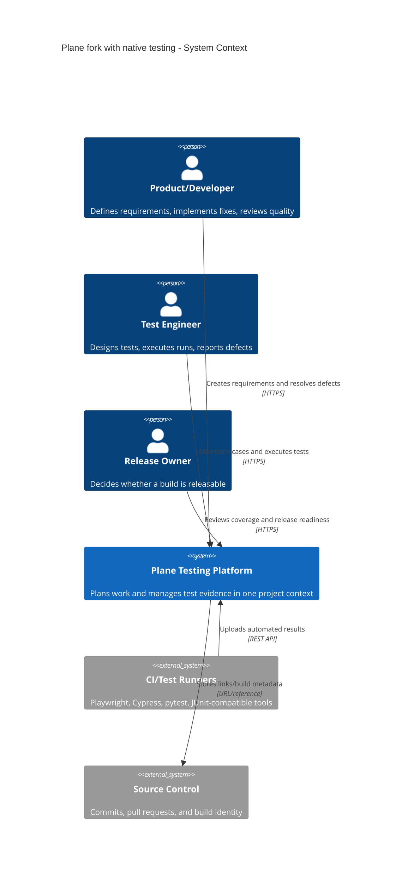
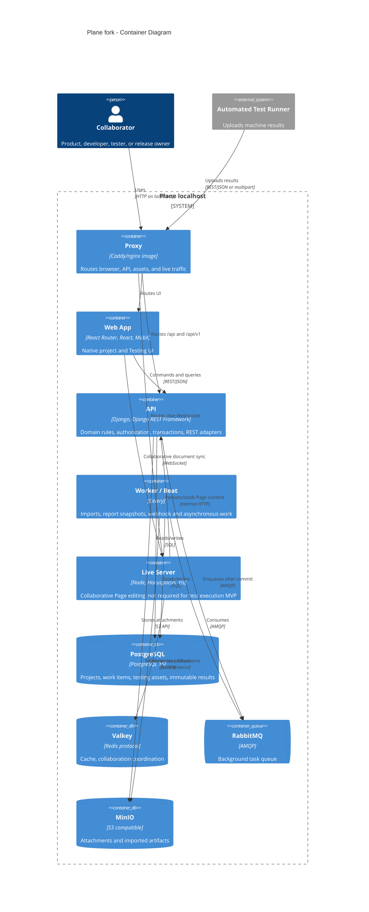
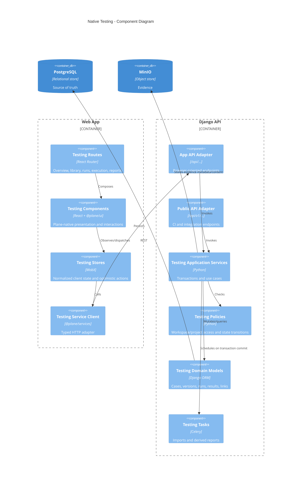
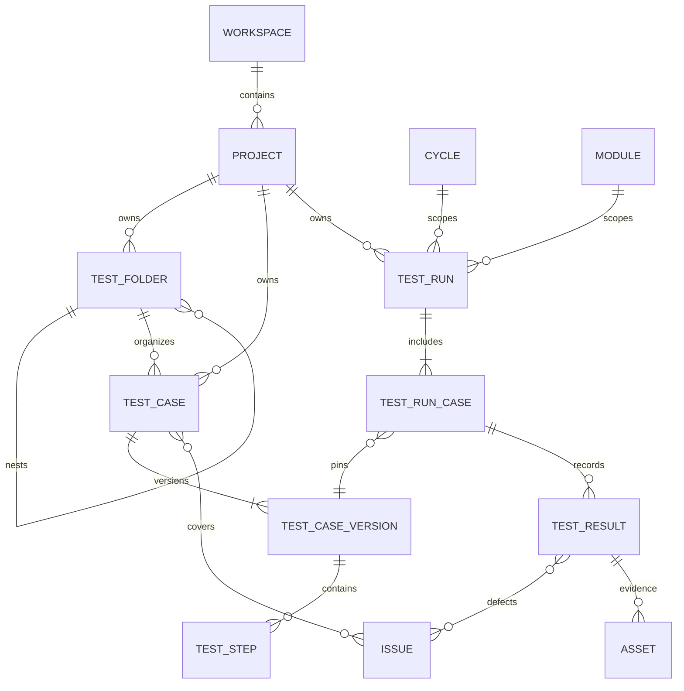
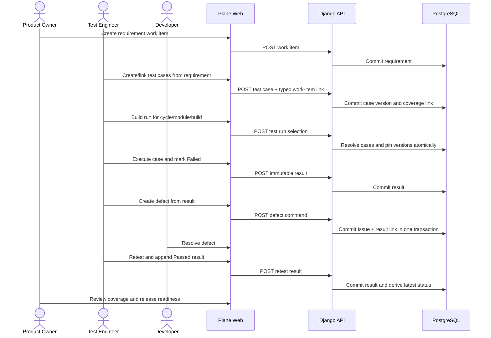
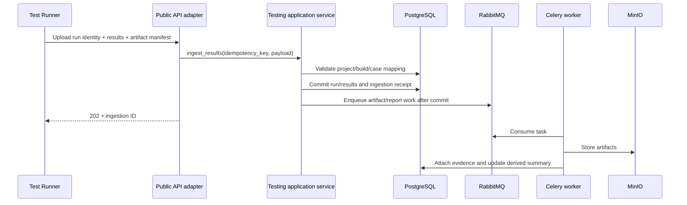

# Plane Testing Platform: Architecture and Delivery Workflow

Status: proposed  
Baseline: `d3d3de44cf13991025783c598d8b34229fb47729` (`preview`, 2026-07-13)  
Audience: product, design, frontend, backend, QA, and maintainers of this fork

## 1. Purpose

This document is the architectural contract for adding native test management to Plane. It has two goals:

1. Preserve Plane's existing product language and boundaries while adding test cases, test runs, execution results, traceability, and reports.
2. Make reverse engineering and feature delivery repeatable, reviewable, testable, and safe to rebase onto future upstream Plane releases.

The first deployment target is a single-user localhost instance. The design keeps workspace and project isolation because those invariants are already fundamental to Plane and removing them would make upstream rebases and later collaboration harder.

## 2. Architecture principles

1. **Project is the aggregate boundary.** Testing assets belong to a Plane project and reuse its workspace, members, cycles, modules, work items, attachments, and activity concepts.
2. **Test cases are not work items.** A reusable test asset and a completable unit of work have different lifecycles. They are linked, not inherited.
3. **Execution history is immutable.** A completed result points to a test-case version snapshot. Editing the library never rewrites historical evidence.
4. **One domain, multiple adapters.** Web UI endpoints and public automation endpoints call the same application services and authorization policies.
5. **Prefer extension seams over upstream edits.** New testing directories and narrow registry additions reduce merge conflicts with Plane upstream.
6. **Every vertical slice includes tests.** A feature is incomplete without model invariants, API contracts, UI state tests, and a critical-path acceptance test.
7. **Architecture is executable documentation.** C4 diagrams, ADRs, API schemas, migrations, and tests must agree.

## 3. C4 model

### 3.1 Level 1: system context



Localhost phase note: these people may be the same person. Keeping the roles visible prevents the UX from optimizing one activity at the expense of the complete delivery loop.

### 3.2 Level 2: containers



The current deployment also contains Admin and Space apps. Native Testing is initially scoped to the authenticated Web App. Space publication and Admin controls are explicit later decisions, not accidental dependencies.

The Compose boundary must pass configuration into the container that expands it. In particular, Caddy receives
`SITE_ADDRESS` and certificate/trusted-proxy settings, while Live receives its shared `LIVE_SERVER_SECRET_KEY` and the
internal `API_BASE_URL=http://api:8000`. Values present only in the host `.env` are not automatically visible to a
container and must not be treated as an implicit cross-container contract.

The localhost source overlay also supplies the browser-facing `WEB_URL` and `APP_BASE_URL` to API, worker, beat worker
and migrator containers; both default to `http://localhost`. Authentication redirects must use the proxy's published
origin, not the Web container's unpublished development port.

### 3.3 Level 3: Testing components



### 3.4 Level 4: core domain/code map

Proposed code is grouped by domain while following Plane conventions:

```text
apps/api/plane/db/models/testing/
  folder.py
  case.py
  run.py
  result.py
  traceability.py
apps/api/plane/app/serializers/testing/
apps/api/plane/app/views/testing/
apps/api/plane/app/urls/testing.py
apps/api/plane/api/serializers/testing/
apps/api/plane/api/views/testing/
apps/api/plane/api/urls/testing.py
apps/api/plane/testing/services/
apps/api/plane/testing/policies/
apps/api/plane/testing/selectors/
apps/api/plane/testing/tasks/

packages/types/src/testing/
packages/services/src/testing/
apps/web/core/store/testing/
apps/web/core/components/testing/
apps/web/app/(all)/[workspaceSlug]/(projects)/projects/(detail)/[projectId]/testing/
```

The application service layer is intentional. Current Plane features often place orchestration in viewsets; duplicating that approach across app and public APIs would create two implementations of version pinning and result transitions. Testing's higher audit requirements justify a shared use-case layer.

## 4. Domain model and invariants



Required invariants:

- Every related entity has the same `workspace_id` and `project_id`.
- A test case owns a monotonically increasing version number unique per case.
- Published versions are immutable; editing creates a new version in one transaction.
- A result references the exact version that was executed.
- Closed runs cannot change membership or result history.
- Result status transitions are explicit: `open -> passed|failed|blocked|skipped`; retest appends a new result.
- Defects and requirements are Plane `Issue` records connected by typed link tables.
- Destructive library operations use Plane's soft-delete conventions; execution evidence is retained.
- Dynamic run selection is represented as data (`TestRunSelectionRule`), never as executable client-provided query fragments.

## 5. Information flows

### 5.1 Requirement to release



### 5.2 Automated result ingestion



Automation rules:

- Require an idempotency key per upload.
- Return per-result mapping errors instead of silently creating duplicate cases.
- Store raw importer metadata for diagnostics, but keep normalized results as the reporting source.
- Never make release status depend on Celery completing; transactional result rows are authoritative.

## 6. Collaboration operating model

### 6.1 Product workflow inside Plane

Use the integrated product to build itself:

```text
Module (capability)
  -> Work item (user outcome)
    -> architecture/design notes
    -> linked test cases (acceptance contract)
    -> implementation PR/commit link
    -> test run in the target cycle/build
    -> defects and retests
    -> release-readiness evidence
```

Recommended responsibilities, even when one person temporarily performs several roles:

| Activity                        | Product/Design | Developer   | Test Engineer     | Maintainer/Release |
| ------------------------------- | -------------- | ----------- | ----------------- | ------------------ |
| Problem and user outcome        | Accountable    | Consulted   | Consulted         | Informed           |
| UX flow and states              | Accountable    | Consulted   | Consulted         | Informed           |
| ADR and domain invariants       | Consulted      | Responsible | Consulted         | Accountable        |
| Acceptance examples             | Consulted      | Consulted   | Responsible       | Accountable        |
| Code and unit/integration tests | Informed       | Responsible | Consulted         | Accountable        |
| Exploratory and regression run  | Informed       | Supports    | Responsible       | Accountable        |
| Migration/release decision      | Informed       | Supports    | Provides evidence | Accountable        |

### 6.2 Definition of Ready

A work item may enter implementation when it has:

- A user outcome and non-goals.
- UX states: loading, empty, success, validation, permission failure, server failure, and destructive confirmation.
- Domain rules and affected C4 components.
- API request/response or event contract.
- Data migration/rollback assessment.
- Linked acceptance test cases, including at least one unhappy path.
- Upstream-conflict assessment: extension-only, registry touch, or core modification.

### 6.3 Definition of Done

- Acceptance criteria demonstrated through a named test run.
- Unit and API contract tests pass.
- Frontend type/lint/format checks pass.
- Critical workflow acceptance test passes.
- Authorization and cross-project isolation are tested.
- Migration applies to empty and representative existing databases.
- Observability/error behavior is reviewed.
- C4/code map and ADR are updated when a boundary changed.
- No unexplained snapshot or generated-file changes.
- Rebase notes identify upstream files touched.

## 7. Reverse-engineering workflow

Every unfamiliar Plane capability is investigated through the same trace, recorded in the work item or a short discovery note:

1. **Pin the baseline.** Record upstream commit, branch, container tags, and schema migration head.
2. **Start from behavior.** Capture route, screenshots/states, permissions, requests, and visible side effects.
3. **Trace the frontend.** Route -> component -> MobX store -> `@plane/services` client -> shared type.
4. **Trace the backend.** URL -> view/viewset -> serializer -> query/service -> model -> transaction boundary.
5. **Trace asynchronous effects.** `transaction.on_commit` -> Celery task -> DB/object store/webhook.
6. **Trace collaboration separately.** The Live/Yjs server is for collaborative documents; do not assume it is the event bus for normal entity CRUD.
7. **Locate extension seams.** Prefer new domain files plus navigation/URL/model export registries.
8. **Characterize before changing.** Add a contract or characterization test when existing behavior is unclear.
9. **Write an ADR for irreversible choices.** Data ownership, version semantics, API compatibility, and event delivery qualify.
10. **Update the architecture diff.** State which C4 elements and arrows changed in the PR.

Reverse-engineering evidence checklist:

```text
[ ] route and UI entry
[ ] service method and endpoint
[ ] authorization class/policy
[ ] serializer and validation
[ ] model, indexes, constraints, soft-delete behavior
[ ] transaction and task dispatch
[ ] cache/store invalidation
[ ] existing unit/contract/smoke tests
[ ] CE/license boundary
[ ] likely upstream merge-conflict files
```

## 8. Feature delivery workflow

Deliver thin end-to-end slices rather than completing all backend layers before UI work:

```mermaid
flowchart LR
  A[Discovery and characterization] --> B[User flow + acceptance examples]
  B --> C[ADR/API/schema design]
  C --> D[DB invariant + migration test]
  D --> E[Application service + API contract test]
  E --> F[Typed client + MobX store test]
  F --> G[Plane-native UI + component states]
  G --> H[End-to-end acceptance run]
  H --> I[Architecture/rebase review]
  I --> J[Merge and local release]
```



Suggested slices:

1. Create/list/open a standalone test case.
2. Edit a case and preserve its previous version.
3. Link a case to a requirement work item.
4. Create a fixed run and pin selected versions.
5. Execute one case and append a result.
6. Create a Plane defect from a failed result.
7. Retest after defect resolution.
8. Show coverage and release readiness.
9. Import automated results idempotently.

Each slice should be independently usable, migrated, and tested.

## 9. Test strategy

### 9.1 Test layers

| Layer                          | Purpose                              | Required examples                                                       |
| ------------------------------ | ------------------------------------ | ----------------------------------------------------------------------- |
| Pure domain/unit               | Fast invariant feedback              | version increment, transition table, query rule normalization           |
| Model/database                 | Constraints and transaction behavior | cross-project rejection, unique versions, immutable result append       |
| Serializer/application service | Use-case behavior                    | fixed run pins versions; failed result creates linked defect atomically |
| App API contract               | Browser compatibility                | auth, validation shape, pagination, filtering                           |
| Public API contract            | CI compatibility                     | API key scope, idempotency, partial mapping errors                      |
| Store/service unit             | Client state correctness             | optimistic rollback, normalized entity update, stale request handling   |
| Component/Storybook            | UX states and accessibility          | empty library, run progress, result controls, keyboard behavior         |
| End-to-end                     | User outcomes                        | requirement -> run -> failure -> defect -> retest -> readiness          |
| Migration                      | Safe local upgrades                  | clean install, populated upgrade, constraint backfill, rollback plan    |
| Non-functional                 | Safety and scale                     | project isolation, injection resistance, 10k-case pagination            |

### 9.2 Critical acceptance journeys

These journeys block release:

1. Create a case with preconditions and ordered steps; edit it; verify version 1 remains readable from an old run.
2. Link multiple cases to a work item; verify coverage counts and cross-project linking denial.
3. Build a fixed run; change the library; verify run membership and pinned content remain stable.
4. Fail a case, attach evidence, create a defect, resolve it, retest, and retain both results.
5. Retry the same CI upload; verify no duplicate run/results.
6. Upgrade a copy of the localhost database and preserve all Plane and Testing data.

### 9.3 CI quality gates

Fast pull-request gate:

```text
frontend format + lint + types
targeted frontend unit tests
backend unit tests
testing API contract tests
migration consistency check
```

Merge/release gate:

```text
full affected backend suite
production frontend build
critical end-to-end journeys
fresh-install migration
upgrade migration against sanitized database copy
Docker image build and localhost smoke test
```

Flaky tests are defects. A flaky test may be quarantined only with an owner, linked work item, reason, and expiry date; it must not silently retry into green.

## 10. Upstream and fork strategy

Maintain three conceptual branches:

- `upstream-preview`: untouched mirror of Plane upstream.
- `fork-main`: releasable localhost fork.
- short-lived `feature/testing-*`: one vertical slice per branch/PR.

Upgrade workflow:

1. Back up PostgreSQL and MinIO volumes.
2. Fetch upstream and review release notes/migrations.
3. Merge upstream into an upgrade branch; never combine upstream merge and new feature work.
4. Resolve registries/routes first, then domain conflicts.
5. Run Plane characterization tests and Testing suites.
6. Build images tagged with upstream version plus fork revision.
7. Restore a database copy and run migrations/smoke/acceptance tests.
8. Promote to the localhost deployment only after evidence is recorded.

High-conflict surfaces should remain small and documented:

- Django model exports and URL aggregation.
- Project feature/settings type registries.
- Project navigation registry.
- Root store/provider composition.
- Package exports and translation catalogs.
- Docker image/build configuration.

Do not edit upstream migrations. Testing uses its own new migration chain. Avoid broad formatting changes in upstream files.

## 11. Architecture decision records

An ADR is required when changing domain ownership, persistence shape, version semantics, public API compatibility, authorization boundaries, background delivery guarantees, or deployment topology.

Use `docs/architecture/decisions/0000-template.md`. The first proposed ADRs are:

- Test Case as an independent aggregate linked to Work Item.
- Immutable TestCaseVersion and append-only TestResult.
- Shared application services behind app and public API adapters.
- Cycle/Module reuse instead of a second milestone system.
- Asynchronous artifacts with transactional result authority.

## 12. First implementation checkpoint

Before feature code, complete one architecture-enabling change set:

1. Add Testing feature/navigation registries without functional pages.
2. Add empty Testing route and Plane-native empty state.
3. Add backend testing package, URL namespaces, and health/permission probe.
4. Add a frontend service/store skeleton with a contract fixture.
5. Prove all existing checks and new skeleton tests pass.

This checkpoint validates the extension seams and exposes upstream conflicts before domain migrations make the fork expensive to unwind.
